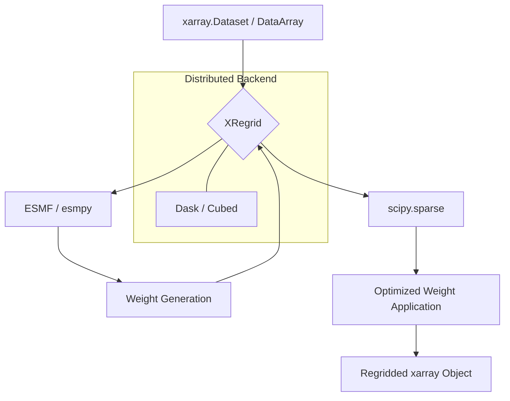

--8<-- "README.md"

## Architecture Overview

XRegrid acts as a high-performance bridge between `xarray` and the `ESMF` (Earth System Modeling Framework). It leverages `esmpy` for robust weight generation and `scipy` for optimized weight application.

XRegrid's architecture is designed for:
1. **Performance**: Optimized sparse matrix operations.
2. **Scalability**: Seamless integration with Dask for large-scale parallel processing.
3. **Correctness**: Leveraging the industry-standard ESMF engine.
4. **Usability**: High-level API that feels natural to xarray users.
